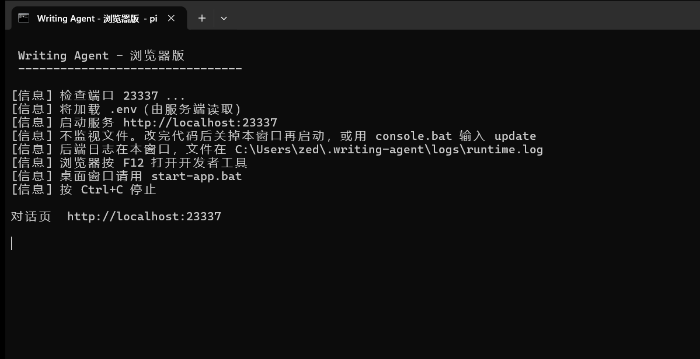
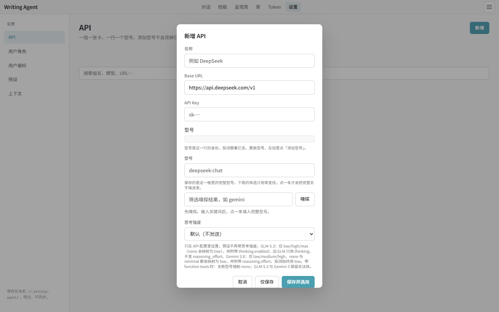
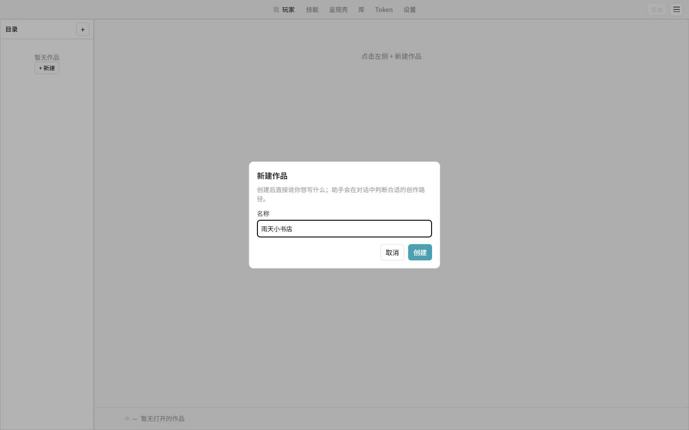
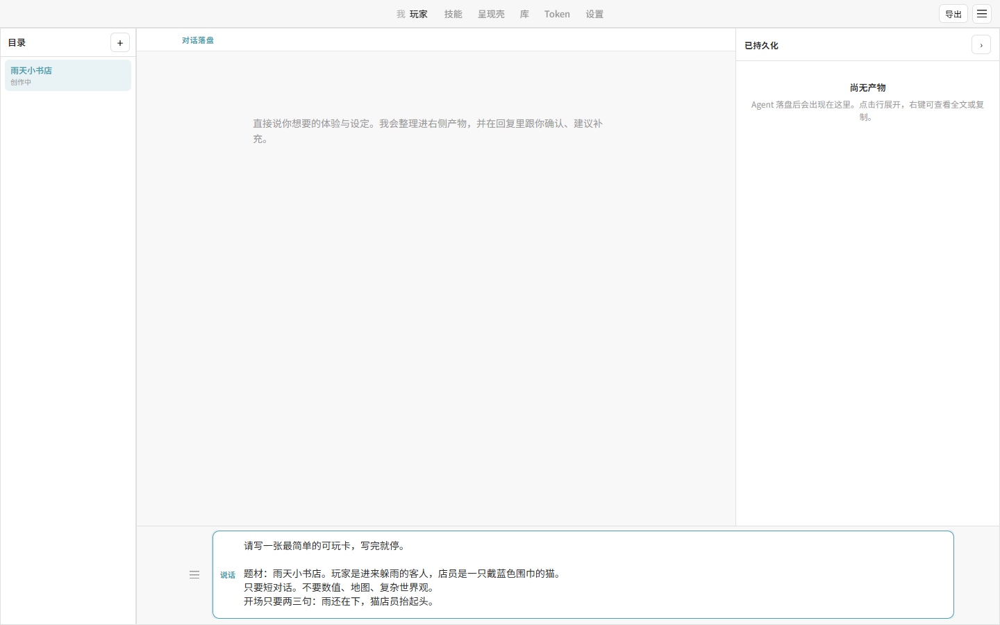
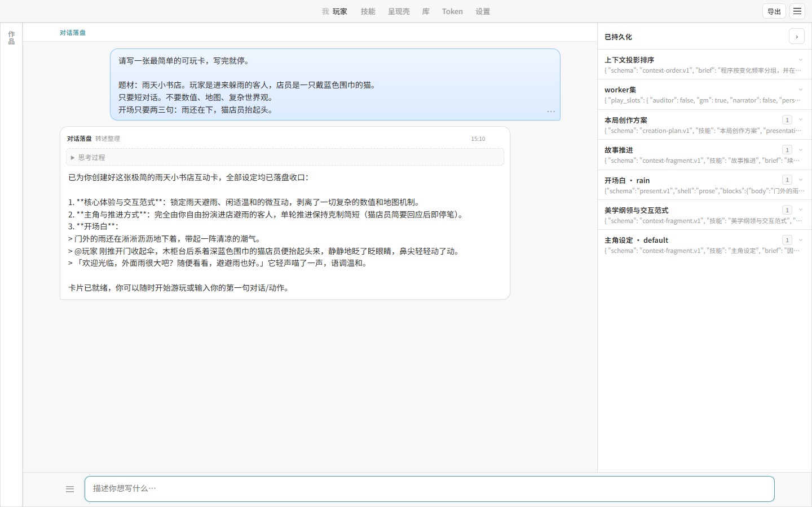
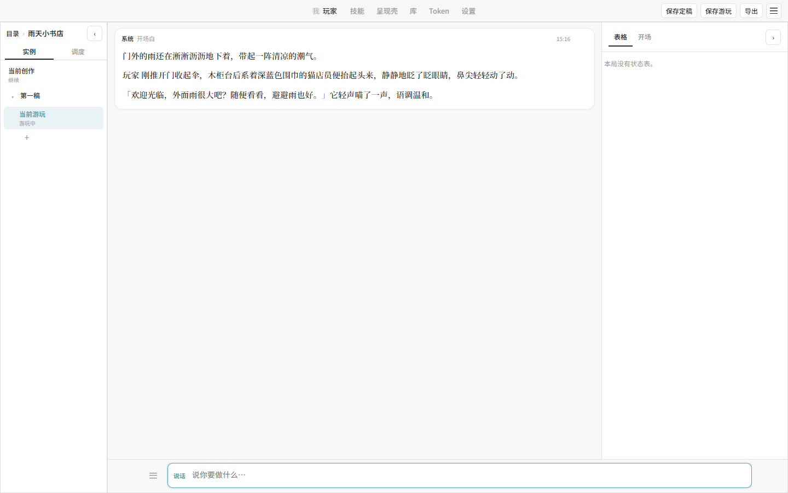
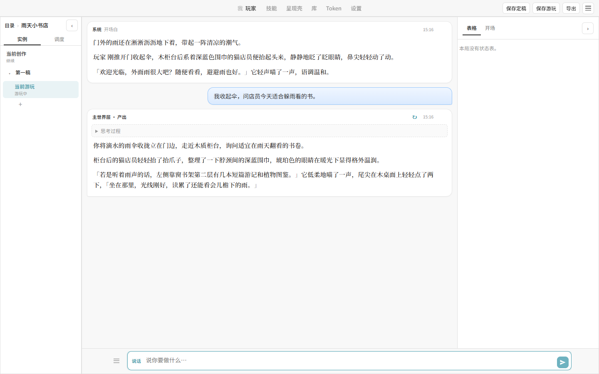

# Writing Agent 使用说明

解压或下载完成后，按下面的顺序即可：双击启动、打开浏览器、写一张最简单的卡，然后游玩一句。

需要先安装 [Node.js](https://nodejs.org/)（勾选安装时附带的 npm）。第一次启动会自动安装依赖，请等黑窗口跑完。

## 1. 双击 `start.bat`

在文件夹里双击 `start.bat`。会弹出一个黑窗口，并自动打开浏览器。地址是：

http://localhost:23337

窗口不要关。关窗口或按 `Ctrl+C` 就是停止软件。



想用桌面窗口而不是浏览器，改双击 `start-app.bat`。后面的操作一样。

## 2. 第一次要填模型接口

点右上角 **设置**，再点 **新增**。填上这四项后点 **保存并选用**：

- 名称：自己认得就行，例如 DeepSeek
- Base URL：接口地址，例如 `https://api.deepseek.com/v1`
- API Key：你的密钥
- 型号：这一行要用的模型名，例如 `deepseek-chat`

填完型号后也可以点 **嗅探**，从列表里点一个型号。



项目根目录如果已经有填好的 `.env`，启动时会自动带上，这一步可以跳过。

## 3. 新建作品

还没有任何作品时，打开页面就会弹出 **新建作品**。输入名称，点 **创建**。以后再开新的，点左侧 **+**。



这里用「雨天小书店」做例子。

## 4. 写一张最简单的卡

在底部输入框里原样贴上这段，点发送（或按 Enter）：

```text
请写一张最简单的可玩卡，写完就停。

题材：雨天小书店。玩家是进来躲雨的客人，店员是一只戴蓝色围巾的猫。
只要短对话。不要数值、地图、复杂世界观。
开场只要两三句：雨还在下，猫店员抬起头。
```



等它写完。中间的回复会说明卡已经好了，右侧 **已持久化** 是落下来的几张卡片。



写完它如果还追问，回复「都不用再加，写完开场就可以开玩」。

## 5. 保存并开玩

右上角出现 **保存定稿** 时，点它，给这份稿起个名字。没有这个按钮时，点输入框右侧的保存图标，效果相同。

然后点左侧的作品名，在弹出的菜单里选 **游玩**。

会先看到开场白：



在底部写你要做的事，再发送。例如：

```text
我收起伞，问店员今天适合躲雨看的书。
```

它会接下去写这一轮：



之后就一直这样：你说一句，它写一轮。右上角 **保存游玩** 可以把进度存下来。

想换你在故事里的名字，到 **设置 → 用户角色** 里新增一个角色并选用。创作时如果希望开场先写占位，把角色名写成 `@玩家`。
