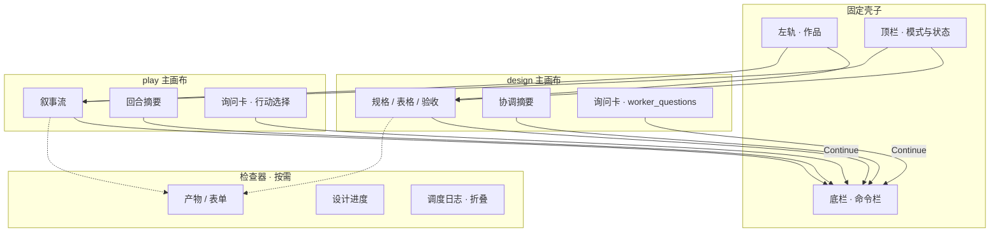

# Web UI 心流设计

> **状态：PX1+ 目标态 / 体验北星。**  
> **PX0 不做按本文大重构**；仅抄补存档/确认/选配方等缺口（见 [`px-roadmap.md`](./px-roadmap.md) WP-U）。  
> 用户可见文案权威仍是 [`ui-glossary.md`](./ui-glossary.md)。

## 1. 定位

Writing Agent 的 Web 界面是 **全屏创作工作台**，不是即时通讯客户端。

**用户可见文案**（阶段名、Worker 名、气泡标题）须服从 **`ui-glossary.md`**：内部仍用 `design` / `design-flow` 等 id，界面映射为「创作」「创作 · 流程编排」等中文。实现见 `src/server/display-labels.ts` 与 `web/display-labels.js`。

| 层 | 角色 |
|----|------|
| **工作面（working surface）** | 主舞台：用户此刻要看、要改、要验收的对象 |
| **协调层（coordination）** | 对话与确认：说明意图、回答问题、触发下一步 |
| **项目轨（project rail）** | 低频：作品切换、快照、模式切换 |
| **系统态（ambient）** | 后台：Agent 执行、调度日志，默认不抢视线 |

**对话是手段，产物与叙事是目的。** 聊天气泡适合承载协调叙事，不适合承载长规格全文或沉浸式阅读。

主场景是 **全屏浏览器、长会话（1–2 小时）**，布局应稳定、可预期，而非频繁切 Tab 或在三块等权面板间跳视线。

相关代码：`web/index.html`、`web/app.js`、`web/agent-ui.js`、`web/styles.css`；视图模型 `src/server/agent-view.ts`。

---

## 2. 两种业务阶段 = 两种主布局

`lifecycleStage`（`design` / `play`）切换时，**主舞台内容应变形**，壳子（顶栏、底栏、左轨）保持同一套肌肉记忆。

### 2.1 创作 `design` — 规格工作台

用户在定义世界、验收 Worker 集、选定开局；核心是 **结构化产物**（JSON 规格、表格、规格卡）。

```text
主视线：正在成形 / 正在审阅的产物
辅视线：协调对话（窄列或底栏上方的摘要条）
冷信息：项目轨、快照、设计进度
```

典型路径：

```text
描述意图 → 主区草稿成形 → 回答追问（表单） → 验收全文 → Accept
              ↑ 主舞台          ↑ 检查器           ↑ 绑在产物上
```

**心流标杆（组合参考）**：Notion（结构化编辑）+ GitHub PR（版本验收）+ NotebookLM（零散想法 → 结构化草稿）。

### 2.2 游玩 `play` — 叙事驾驶舱

用户代入角色、推进回合；核心是 **叙事流 + 世界状态**。

```text
主视线：回合输出（阅读优先，视野占比 70%+）
辅视线：底部命令输入（短、快、位置固定）
冷信息：角色/世界状态抽屉、多 run 存档
```

典型路径：

```text
读回合输出 → 输入行动 → 等生成 → 继续读
     ↑ 主舞台           ↑ 固定底栏
```

**心流标杆**：SillyTavern / 视觉小说阅读器（沉浸叙事）+ Roguelike 存档抽屉（同一开局多条 run）。

`world-simulator` 包说明见 `skills/dialogue/world-simulator/README.md`；流程概念见 `creation-playbook.md`。

---

## 3. 全屏网页约束

与手机 IM（如 QQ）不同，全屏 Web 有以下硬约束：

| 约束 | 设计含义 |
|------|----------|
| **视口宽** | 可横向分栏：工作面 55–65% + 协调区 35–45%，不必单列堆叠 |
| **会话长** | 底栏输入/确认位置永远不变；减少布局跳动 |
| **产物大** | Worker 集、开场白等长文进工作面，不进聊天气泡 |
| **双模式** | 同一壳子、两种主画布，不靠一套气泡布局打天下 |

QQ 等 IM 仅保留一条可借鉴点：**底栏作为唯一行动锚点**。其余按工作台设计。

---

## 4. 壳子布局（Figma 式分区）

全屏下的推荐骨架：

```text
┌────┬──────────────────────────────┬────────────┐
│项目│      主画布（随 stage 变）     │ 检查器      │
│轨  │                              │（按需展开）  │
│窄  │  design: 规格 / 表格 / 验收   │            │
│    │  play:   叙事流              │            │
└────┴──────────────────────────────┴────────────┘
│              命令栏（composer，固定）              │
└──────────────────────────────────────────────────┘
```

| 区域 | 职责 | 频率 |
|------|------|------|
| **左轨** | 作品列表、路径、快照入口 | 低 |
| **顶栏** | 作品名、创作/游玩切换、状态 pill、`waitingReason` 摘要 | 常瞥 |
| **主画布** | 当前任务的工作面 | 主视线 |
| **检查器** | 产物元数据、验收按钮、进度、可编辑表格 | 按需 |
| **命令栏** | 输入、发送、主确认（与检查器不重复） | 手常驻 |

检查器默认 **收起**；有产物验收、结构化填空、开局 swipe 等任务时 **滑出**（推开主画布，窄屏用全屏 drawer）。不是常驻 300px Agent 监控台。

---

## 5. 参考产品（按心流相似度）

| 产品 | 借鉴什么 | 对应本项目的阶段 |
|------|----------|------------------|
| **Cursor `AskQuestion`** | 独立询问卡、字母点选、分页、Skip/Continue、键盘捷径；聊天只留索引 | `worker_questions`（§8；选项可编辑为我们的增强） |
| **ChatGPT 澄清问法** | 题干短、选项 = 完整可采纳句；一次收齐再继续 | 发问侧文案与批大小 |
| **Claude Artifacts / ChatGPT Canvas** | 产物占主视区，对话收窄为协调 | `review_artifact`、Worker 集验收；询问卡放置 |
| **GitHub Pull Request** | 被审对象为主舞台；讨论为时间线；Merge/Request changes 绑在对象上 | Accept、variant 切换、重 roll |
| **Notion / Coda** | 文档/数据库是「家」；AI 辅助不抢主位 | `intake`、变量 schema、Worker 分工 |
| **Figma** | 主画布 + 窄轨 + 按需检查器 | 全屏壳子结构 |
| **SillyTavern / AI Dungeon** | 叙事占满视野；侧栏可收 | `play` 回合阅读 |
| **NotebookLM** | 多源 → 中间协调 → 右侧成型笔记 | 创作开头 intake、草稿预览 |
| **Linear** | 状态一眼可见、操作路径短、装饰极少 | 顶栏状态、长按效率 |

---

## 6. 四条统一原则

跨 `design` / `play` 均遵守：

| 原则 | 含义 | 反面 |
|------|------|------|
| **一屏一事** | 同一时刻只有一个主任务（审产物 / 答提问 / 读叙事） | 侧栏与主画布抢同一决策 |
| **行动点唯一** | Accept、发送、swipe 只在一处出现 | composer 与检查器各放一套接受按钮 |
| **对话是索引** | 气泡放摘要 + 跳转；全文在工作面 | Worker 长产出塞进中间气泡 |
| **底栏锚定** | 输入/确认永远在底部同一区域 | 底栏在纯按钮与 textarea 间大幅换位 |

---

## 7. 消息与面板的职责切分

### 7.1 中间协调区（当前 `message-feed`）

**应展示：**

- 用户输入
- Worker 提问的 **一行索引**（「提问中 · 1/3」）；题干与选项在询问卡（§8）
- 简短结论、错误提示
- 流式 pending（执行中摘要）
- 长产物的 **摘要 +「已在检查器打开」** 链接

**不应展示：**

- `agent_tool`、`orchestrator_decision`、`worker_running`（已在 `FEED_HIDDEN_KINDS`）
- 验收中的产物全文（`review_artifact` 时隐藏 `worker_output`）
- intake 完整表格（仅进度摘要）
- `worker_questions` 的完整选项列表（进 §8 询问卡）

实现：`web/agent-ui.js` 中 `shouldShowInFeed`、`FEED_HIDDEN_KINDS`。

### 7.2 检查器（目标态；调度日志已迁左侧「调度」Tab，右侧 `panel-agent` 已取消）

**应承载：**

- 产物预览 / 编辑 / diff
- intake 结构化表单
- `worker_questions` 的备选容器（主路径见 §8 询问卡）
- 开局 swipe 卡片栈
- 设计进度（Worker 集卡片、步骤）
- **固定上下文（独立区）**：纲领 / 常驻 / 黑板 tag 与 Worker 解耦；每张卡标明 **塞进哪些 Worker**（注入正文 / 常驻挂载 / 读入黑板）
- **上下文 / 黑板**（终产物 tag、定稿摘要、归档计数）
- 验收主按钮（接受 / 不接受；创作：删本单位交互消息只留产物；run：压缩过程 tag）

Worker 卡不再嵌套完整 tag 列表，只显示「上下文」摘要；完整挂载关系见上方固定上下文区。

**应降级折叠：**

- Agent focus、tool trace
- 调度时间线（现「历史」Tab）→ 高级 / 调试模式

### 7.3 命令栏（`composer`）

由 `resolveComposer`（`web/app.js`）按 `phase` + `waitingReason` 变形，但位置不变：

| 态 | 表现 |
|----|------|
| `running` | 轻量状态 + 允许预输入草稿 |
| `approve` / `accept` | 主按钮在底栏；hint 一行 |
| `review_artifact` | 底栏：输入并发送＝改产物；旁挂「接受目前产物」。产物卡上不放接受钮 |
| `intake` / `input` | textarea + 发送 |
| `worker_questions` | **不抢主交互**；主回答在询问卡内（见 §8） |

---

## 8. 结构化询问卡（Questions Card）

`worker_questions` / `ask_user` 的 **首选交互**。壳子与键盘心流对齐 **Cursor `AskQuestion`**；选项语义与文案改写对齐 **ChatGPT / Claude 的「选项 = 可执行草稿」**；放置原则对齐 **Artifacts / Canvas「决策面 ≠ 聊天气泡」**。

### 8.0 业内标杆：借鉴什么、刻意改进什么

| 产品 / 模式 | 借鉴（照抄心流） | 不照抄 / 我们的改进 |
|-------------|------------------|---------------------|
| **Cursor `AskQuestion`** | 独立询问卡（非气泡堆选项）；`A/B/C` 字母点选；`n of N` 分页；底部 **Skip + Continue**；Enter / Esc；聊天流只留「在答」索引 | Cursor 选项多为**只读**，改细节只能塞底部通用备注 → 我们默认**选项文案可改写**，点文案编辑、点字母选中（社区对 Cursor 的高频诉求，见 AskQuestion inline-edit 讨论） |
| **ChatGPT** | 澄清问法：题干短、选项是完整可采纳句；多题一次收齐再继续；自由补充不抢主路径 | 不用纯聊天气泡做多选题主交互；长选项不进 feed |
| **Claude Artifacts / ChatGPT Canvas** | 「结构化决策 / 产物」与对话分离：卡/面板是工作面，聊天是协调 | 询问卡不是 Artifact 全文，而是短决策面；验收长产物仍走检查器 |
| **Linear / GitHub PR 决策** | 一屏一事、主按钮唯一、状态一眼可见 | 不引入 Issue 式侧栏评论串 |

**产品结论（写死）：**

1. **主路径 = Cursor 式询问卡**（字母选中 + Continue），不是 QQ/ChatGPT 气泡里的长问答。
2. **选项 = 可编辑草稿**（相对 Cursor 默认只读的增强）：多数一点即答；不满意就改文案再选，不必另开 Other。
3. **对话流只索引**：「提问中 · 1/3」；题干与选项只在卡上。
4. **命令栏降级**：本态不当主输入；可选「自由补充」兜底，语义从属于卡上 Continue。

```text
┌─────────────────────────────────────────────┐
│  ? Questions                    ▲ ▼  1 of 3 │
├─────────────────────────────────────────────┤
│  1. Q1: 问题正文……                           │
│     [A]  选项文案（可编辑） ← 点文案 = 改写     │
│     [B]  选项文案…         ← 点字母 = 选中     │
│     [C]  选项文案…                           │
│     [+]  Other…  [_________]                 │
│                                             │
│  2. Q2: ……                                  │
│     …                                       │
├─────────────────────────────────────────────┤
│                    Skip Esc   [ Continue ↵ ]│
└─────────────────────────────────────────────┘
```

**最关键交互：选项默认可改写；点选项文案是编辑，点字母按钮才是选中。**  
Agent 给的选项是「可编辑草稿」，不是只读单选列表。

### 8.1 为什么适合本产品

| 特质 | 对用户心流的作用 | 业内对应 |
|------|------------------|----------|
| **点选优先，改写兜底** | 多数情况一点字母即答；不满意就改文案再选，不必另开 Other | Cursor 点选 + ChatGPT「改一句再说」 |
| **选项即可执行语义** | 提交的是用户确认（或改写后）的完整句子，可直接喂给 worker | ChatGPT / Claude 澄清选项写法 |
| **编辑与选中分离** | 避免「想改一下措辞」却误触提交路径；符合「一屏一事」 | 相对 Cursor 只读选项的增强 |
| **分页批次** | 「1 of 3」管理预期；单屏别堆太多题 | Cursor `AskQuestion` |
| **键盘捷径** | Enter = Continue，Esc = Skip；字母键可选中（可选增强） | Cursor / IDE 习惯 |
| **模态焦点** | 当前这一批问清了再 Continue | Cursor 卡内提交；非边聊边答 |

适用：`design` 里 intake 追问、规格确认；`play` 里「局面 + 可选行动」；凡原先要用户在 composer 里写长段回答的提问，优先改成卡。

### 8.2 放置

| 区域 | 职责 | 业内对应 |
|------|------|----------|
| **主画布消息流下方（推荐）** | 询问卡嵌在协调列底部（composer 之上），宽度随列自适应，不遮盖历史消息 | 决策面与对话分离，但占文档流而非浮层 |
| **检查器** | 备选：与产物并排时，卡可嵌在检查器顶部；长产物场景优先主画布居中卡 | Canvas / 侧栏表单 |
| **中间气泡** | 只留一行索引：「Worker 提问中 · 1/3」；点开回到卡 | Cursor：聊天不堆完整选项列表 |
| **命令栏** | 降级：本态不当主输入；仅作兜底自由补充（可选） | Cursor 底部「optional details」——我们刻意弱化，主语义在选项改写 |

Continue 提交后：卡收起 → 系统 `running` → 回复摘要进对话流（摘要用**用户最终确认的文案**，含改写）。

### 8.3 卡片结构与命中区

| 元件 | 规则 | 对齐 |
|------|------|------|
| **Header** | 标题「Questions」+ 批次 `n of N` + 上下翻批 | Cursor |
| **题干** | 编号 `1.`；一句说清决策点；避免在选项里复述背景 | ChatGPT 澄清问法 |
| **字母按钮 `[A]`…** | **唯一「选中」命中区**；选中后该行高亮；同题单选 | Cursor |
| **选项文案区** | **默认可编辑**；点击文案（或已聚焦时）进入改写，**不触发选中** | 相对 Cursor 的增强（社区诉求） |
| **Other…** | 每题末可选；短输入；与改写选项二选一语义相同——都是「自拟答案」 | Cursor Other + ChatGPT 自由答 |
| **Skip** | 本批可跳过（Esc）；下游需能处理「未答」 | Cursor |
| **Continue** | 主按钮（Enter）；校验必选题已有选中项（提交的是该选项当前文案） | Cursor |

#### 8.3.1 编辑 vs 选中（强制）

```text
一行选项 = [字母按钮] + [文案区域]

点 [A]     → 选中 A（提交候选变为 A 的当前文案）
点 文案区   → 进入编辑；改写本地草稿；不改变选中态
            （若尚未选中，可编辑完再点字母选中；
             若已选中 A 又改了文案，提交仍用改写后的 A）
```

细则：

1. **默认所有选项文案可改**（含 Agent 预填的 A/B/C）；不是「只能选、想改去 Other」（Cursor 现状的痛点，我们默认解掉）。
2. **点文案 ≠ 选中**。禁止「点整行即选中」的常见单选实现。
3. **只有字母按钮（或等价：键盘 A/B/C）负责选中**。
4. 编辑中：Enter 可结束编辑并保持焦点在卡内；勿与 Continue 的 Enter 冲突（编辑态下 Enter = 收起编辑）。
5. 提交 payload 必须带上 **最终文案**（`label` / `text`），不能只交 `optionId`——否则改写丢失（ChatGPT/Cursor 都要求「用户说了什么」完整回传）。
6. Other 与「改写某选项」并存：Other 是空槽自拟；改写是在 Agent 草稿上微调。二者都合法。

多批：Continue 先推进当前页，再进下一批；**全部页完成后再**统一提交并解除 `waiting_user`（对齐 Cursor 一批问清再继续）。

### 8.4 与 runtime 的契约

`askUser` / `ask_user` 已支持结构化 `QuestionItem[]`（兼容旧 `string[]`）。提交走 `POST /api/sessions/:id/answers`：

```ts
{
  answers: [
    { questionId: "q1", optionId: "A", text: "（用户看到的/改写后的完整句）" },
    { questionId: "q2", optionId: "other", text: "…" },
  ]
}
```

前端：主画布消息流下方询问卡（点字母选中、点文案编辑、分页 Continue）；气泡可只显示答句，发给 AI 仍含问+答。

Worker / Agent 发问侧（对齐 Cursor AskQuestion：询问不阻断主产出）：

- 总管 `ask_user`：**assessment 是主内容**；`questions` 挂在其下，用户可 Skip 并请编排器基于现有信息继续。
- Worker：优先 `outputs` + `askUser` 同时给出；有产物时追问挂在验收态下，用户可直接「接受目前产物」而不作答。仅完全无法产出时才阻塞提问。
- 能推断选项时 **必须** 给 `options`；每项写成用户可直接采用或微调的**建议示范**（可含短场景钩子），禁止空泛「是 / 否」。
- `editable` 默认 `true`；挂载题 `required` 默认 `false`。
- 单批题量控制在 Cursor 舒适区：**默认每页 1 题（左右切换），整批不宜超过 5 题**；更细的拆到下一轮 `ask_user`。

过渡期：仅有 `string[]` 时，UI 将每题渲染为题干 + Other。询问卡首屏可展示 `waitingReason.message` 中的内容评价。

实现：`web/questions-ui.js`、`web/styles.css`（`.qcard*`）、`web/agent-ui.js` 索引气泡。

### 8.5 反模式

- 点整行 / 点文案就选中（应点字母才选中）— 违反 Cursor 式命中区
- 选项只读、想改只能走 Other 或底栏备注（Cursor 痛点，禁止照抄）
- 提交只带 `optionId`、丢掉用户改写后的 `text`（业内答案回传完整性要求）
- 把 5+ 道长选项塞进一条聊天气泡（ChatGPT/Cursor 都已证明劣于独立卡）
- 选项写「是 / 否」却题干含糊
- Continue 与底栏「发送」并存且语义不同
- 无 Skip/必答标记，用户卡死无法继续
- 编辑态下 Enter 误触 Continue 整卡提交

---

## 9. `waitingReason` × `lifecycleStage` 显示规格

目标态 UI 分配表（实现时对照 `agent-view` 的 `buildFocus` 与 `actions`）。

| waitingReason / phase | design 主画布 | play 主画布 | 检查器 | 命令栏 | 顶栏状态 |
|------------------------|---------------|-------------|--------|--------|----------|
| `idle` / 未打开作品 | 空状态引导 | — | 关 | 禁用 | — |
| `intake` | 空或首条引导文案 | — | intake 表单（有字段时展开） | 描述需求 + 发送；必要项满则确认 | 描述创作需求 |
| `input`（首句） | 协调摘要 | 叙事历史 | 关 | 发送 | 描述 / 补充 |
| `input`（补充） | 协调摘要 | 叙事历史 | 关 | 发送 | 补充说明 |
| `running` | 流式 pending | 流式 pending | 关 | 等待态（可预输入） | Agent/Skill 执行中 |
| `worker_questions` | **询问卡（§8）** + 一行索引气泡 | 同左；行动题尤其用选项 | 可选副展示 | 降级；可 Skip | 回答提问 |
| `approve_step` | 决策摘要 | 决策摘要 | 可选：待 invoke 说明 | 确认 / 暂不 / 说明意见 | 建议 invoke |
| `review_artifact` | 「请验收」摘要；若有挂载题则询问卡可选（**Accept 即收起**） | 同左 | **产物全文 + 接受/不接受** | 修改意见（可选）；接受 = 无需再完善 | 验收产物 |
| `revision` | 修改说明上下文 | 同左 | 相关产物 | 按 instruction 输入 | 修订中 |
| opening swipe（业务） | 卡片栈主舞台 | — | 版本 nav + 锁定 | 选定 / 换一版 | 选定开局 |
| `done` | 阶段结束摘要 | 会话结束 | 关 | 空闲提示 | 已完成 |

`skill_selection` 为遗留恢复态，UI 引导用户发消息继续即可。

---

## 10. 阶段心流图



---

## 11. 现状与目标差距

| 现状（`web/`） | 心流问题 | 目标 |
|----------------|----------|------|
| ~~右侧常驻 `panel-agent`~~ | ~~空跑时也占视线~~ | **已做**：取消右侧栏；调度日志迁左侧「调度」Tab；开写后缩进侧栏 |
| ~~focus / tool-trace 在右侧顶部~~ | ~~像 IDE 调试台~~ | **已做**：并入左侧「调度」 |
| intake 可在 feed 与 composer 两处 | 信息重复 | 表格进检查器，feed 仅摘要 |
| `worker_questions` = 文本列表 + composer | 用户写长段、选项语义易丢 | **§8 询问卡**：文案可改、点字母选中 |
| `askUser: string[]` | 无 options / Other / 分页 | 升级 `QuestionItem` 协议 |
| 验收时 composer 与「验收」Tab 均可操作 | 行动点分散 | 主按钮只在检查器 |
| ~~移动端隐藏整个 `panel-agent`~~ | ~~无产物面~~ | **已做**：无右侧栏；窄屏缩进左侧轨 |
| 主区标题写「agent-first」 | 与产品定位不符 | 创作 = 产物优先；游玩 = 叙事优先 |

已有正确方向（保持并强化）：

- SillyTavern 式气泡与左右对齐（`play` 适用）
- `FEED_HIDDEN_KINDS` 分流内部消息
- `review_artifact` 时产物不进 feed、自动切验收视图
- 底栏 `composer` 按 `waitingReason` 变形

---

## 12. 实现备注

- 视图数据：`SessionView` / `buildAgentView`（`src/server/agent-view.ts`）已区分 `messages`、`reviewArtifact`、`waitingReason`、`actions`、`intake`；询问卡需扩展 questions 结构，见 §8.4。
- 消息分类：`classifyAgentMessage`、`EnrichedMessage.kind` 驱动 feed 过滤；`worker_questions` 在 feed 仅留索引。
- 生命周期：`inferLifecycleStage`、`body[data-lifecycle]`（`web/agent-ui.js`）控制 accent；可扩展为 **主画布布局切换**。
- 验收：`renderReviewPanel` → 迁移为检查器主内容，与 composer 去重。
- 设计进度：`renderSkillGuide` / `worker-set-user-panel` → 检查器内按需 Tab，非默认主视图。
- 发问侧：`src/worker/executor.ts` 的 `askUser`、docs/`worker-skill-format.md` §ask_user → 支持带 `options` 的结构化问题。

改版时建议顺序：

1. 检查器按需展开 + 验收动作收敛  
2. **§8 询问卡 UI**（先兼容现有 `string[]`，再补 options 协议）  
3. design 主画布产物优先（收窄协调列）  
4. play 叙事区拉满 + 状态抽屉  
5. 调度日志降级为高级折叠  
6. 窄屏 drawer 与 opening swipe 专屏  

---

## 13. 相关文档

| 文档 | 关系 |
|------|------|
| `architecture.md` | 总览；UI 为 Session 的人机界面 |
| `creation-playbook.md` | design → play 业务流程 |
| `runtime-state-machine.md` | `waitingReason` 定义 |
| `worker-skill-format.md` | `ask_user` / 提问侧契约 |
| `run-snapshot.md` | 快照与分支；左轨/检查器入口 |
| `implementation-guide.md` | 写代码规则与文档地图 |
| `book-storage.md` | 作品、存档、资产形态 |
